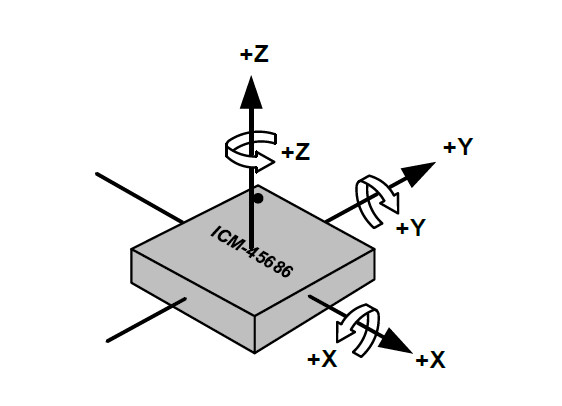
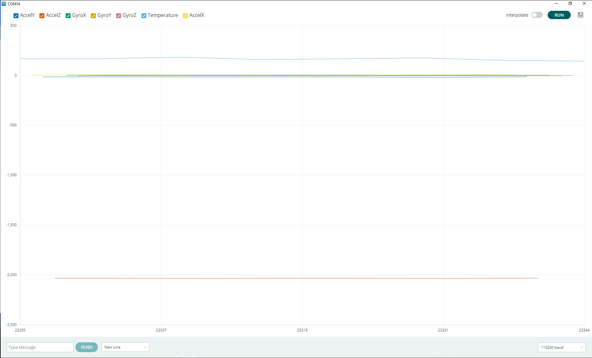

# ICM456xx Arduino library
This arduino library for the [TDK/Invensense ICM456xx High Performance 6-Axis MotionTracking<sup>(TM)</sup> IMU](https://invensense.tdk.com/products/motion-tracking/6-axis/icm-456xy/).
The ICM-456xx is a high performance 6-axis MEMS MotionTracking device. It has a configurable host interface that supports I3C<sup>SM</sup>, I2C and SPI serial communication, and an I2C master mode interface for connection to external sensors. The device features up to 8Kbytes FIFO and 2 programmable interrupts.
This library supports both I2C and SPI commmunication with the ICM456xx.

# Software setup
Use Arduino Library manager to find and install the ICM456xx library.

# Hardware setup
There is currently no Arduino shield for the ICM456xx.
The wiring must be done manually between the Arduino motherboard and the ICM456xx eval board.
The below wiring description is given for an Arduino Zero board, it depends on the interface to be used:
* I2C

|Arduino Zero|ICM456xx eval board|
| --- | --- |
| 5V         | CN1.19         |
| GND        | CN1.11         |
| SDA        | CN1.18         |
| SCL        | CN1.16         |

* SPI

|Arduino Zero|ICM456xx eval board|
| --- | --- |
| 5V         | CN1.19         |
| GND        | CN1.11         |
| MISO=SPI.1 | CN1.20         |
| MOSI=SPI.4 | CN1.18         |
| SCK=SPI.3  | CN1.16         |
| CS=DIG.8   | CN1.4          |

Note: SPI Chip Select can be mapped on any free digital IO, updating the sketches accordingly.

* Interrupt

|Arduino Zero|ICM456xx eval board|
| --- | --- |
| DIG.2        | CN1.3        |

Note: Interrupt pin can be mapped on any free interruptable IO, updating the sketches accordingly.

## Orientation of axes

The diagram below shows the orientation of the axes of sensitivity and the polarity of rotation. Note the pin 1 identifier (•) in the
figure.



# Library API

## Create ICM456xx instance

**ICM456xx(TwoWire &i2c,bool lsb)**

Create an instance of the ICM456xx that will be accessed using the specified I2C. The LSB of the I2C address can be set to 0 or 1.  
I2C default clock is 400kHz.

```C++
ICM456xx IMU(Wire,0);
```

**ICM456xx(TwoWire &i2c,bool lsb, uint32_t freq)**

Same as above, specifying the I2C clock frequency (must be between 100kHz and 1MHz)

```C++
ICM456xx IMU(Wire,0,1000000);
```

**ICM456xx(SPIClass &spi,uint8_t cs_id)**

Create an instance of the ICM456xx that will be accessed using the specified SPI. The IO number to be used as chip select must be specified.  
SPI default clock is 6MHz.

```C++
ICM456xx IMU(SPI,8);
```

**ICM456xx(SPIClass &spi,uint8_t cs_id, uint32_t freq)**

Same as above, specifying the SPI clock frequency (must be between 100kHz and 24MHz)

```C++
ICM456xx IMU(SPI,8,12000000);
```


**/!\ This library does NOT support multiple instances of ICM456xx.**


## Initialize the ICM456xx
Call the begin method to execute the ICM456xx initialization routine. 

**int begin()**

Initializes all the required parameters in order to communicate and use the ICM456xx.

```C++
IMU.begin();
```

## Log sensor data

**int startAccel(uint16_t odr, uint16_t fsr)**

This method starts logging with the accelerometer, using the specified full scale range and output data rate.
Supported ODR are: 1, 3, 6, 12, 25, 50, 100, 200, 400, 800, 1600, 3200, 6400 Hz (any other value defaults to 100 Hz). 
Supported full scale ranges are: 2, 4, 8, 16, 32 G (any other value defaults to 16 G).

```C++
IMU.startAccel(100,16);
```

**int startGyro(uint16_t odr, uint16_t fsr)**

This method starts logging with the gyroscope, using the specified full scale range and output data rate.
Supported ODR are: 1, 3, 6, 12, 25, 50, 100, 200, 400, 800, 1600, 3200, 6400 Hz (any other value defaults to 100 Hz). 
Supported full scale ranges are: 16, 31, 62, 125, 250, 500, 1000, 2000, 4000 dps (any other value defaults to 2000 dps).

```C++
IMU.startGyro(100,2000);
```

**int getDataFromRegisters(inv_imu_sensor_data_t& imu_data)**

This method reads the ICM456xx sensor data from registers and fill the provided event structure with sensor raw data.
Raw data can be translated to International System using the configured FSR for each sensor. Temperature in Degrees Centigrade = (TEMP_DATA / 128) + 25

```C++
  inv_imu_sensor_data_t imu_data;
  IMU.getDataFromRegisters(imu_data);
  Serial.print("AccelX:");
  Serial.println(imu_data.accel_data[0]);
  Serial.print("AccelY:");
  Serial.println(imu_data.accel_data[1]);
  Serial.print("AccelZ:");
  Serial.println(imu_data.accel_data[2]);
  Serial.print("GyroX:");
  Serial.println(imu_data.gyro_data[0]);
  Serial.print("GyroY:");
  Serial.println(imu_data.gyro_data[1]);
  Serial.print("GyroZ:");
  Serial.println(imu_data.gyro_data[2]);
  Serial.print("Temperature:");
  Serial.println(imu_data.temp_data);
```

**int enableFifoInterrupt(uint8_t intpin, ICM456xx_irq_handler handler, uint8_t fifo_watermark)**

This method initializes the fifo and the interrupt of the ICM456xx. The interrupt is triggered each time there is enough samples in the fifo (as specified by fifo_watermark), and the provided handler is called.
Any interuptable pin of the Arduino can be used for intpin.

```C++
uint8_t irq_received = 0;

void irq_handler(void)
{
  irq_received = 1;
}
...

// Enable interrupt on pin 2, Fifo watermark=10
IMU.enableFifoInterrupt(2,irq_handler,10);
```

**int getDataFromFifo(inv_imu_fifo_data_t& imu_data)**

This method reads the ICM456xx sensor data samples stored in the FIFO.
Raw data can be translated to International System using the configured FSR for each sensor. Temperature in Degrees Centigrade = (TEMP_DATA / 2) + 25

```C++
      inv_imu_fifo_data_t imu_data;
      IMU.getDataFromFifo(imu_data);
      // Format data for Serial Plotter
      Serial.print("AccelX:");
      Serial.println(imu_data.byte_16.accel_data[0]);
      Serial.print("AccelY:");
      Serial.println(imu_data.byte_16.accel_data[1]);
      Serial.print("AccelZ:");
      Serial.println(imu_data.byte_16.accel_data[2]);
      Serial.print("GyroX:");
      Serial.println(imu_data.byte_16.gyro_data[0]);
      Serial.print("GyroY:");
      Serial.println(imu_data.byte_16.gyro_data[1]);
      Serial.print("GyroZ:");
      Serial.println(imu_data.byte_16.gyro_data[2]);
      Serial.print("Temperature:");
      Serial.println(imu_data.byte_16.temp_data);
```

**inv_imu_sensor_data_t**

This structure is used by the ICM456xx driver to return raw sensor data. Available data is:
|Field name|description|
| --- | --- |
| accel_data[3]   | 3-axis accel raw data                  |
| gyro_data[3]    | 3-axis gyro raw data                   |
| temp_data       | Temperature raw data (2 bytes)         |

**inv_imu_fifo_data_t**

This structure is used by the ICM456xx driver to return FIFO raw sensor data. Available data is:
|Field name|description|
| --- | --- |
| header                | Mask describing available data           |
| byte_8.header         | Mask describing available data           |
| byte_8.sensor_data[3] | Single enabled sensor raw data (16 bits) |
| byte_8.temp_data      | Temperature raw data (1 byte)            |
| byte_16.header        | Mask describing available data           |
| byte_16.accel_data[3] | 3-axis accel raw data (16 bits)          |
| byte_16.gyro_data[3]  | 3-axis gyro raw data  (16 bits)          |
| byte_16.temp_data     | Temperature raw data (1 byte)            |
| byte_16.timestamp     | Timestamp in us (2 bytes)                |
| byte_20.header        | Mask describing available data           |
| byte_20.accel_data[3] | 3-axis accel raw data (20 bits)          |
| byte_20.gyro_data[3]  | 3-axis gyro raw data (20 bits)           |
| byte_20.temp_data     | Temperature raw data (2 bytes)           |
| byte_20.timestamp     | Timestamp in us (2 bytes)                |

## APEX functions

**int startTiltDetection(uint8_t intpin, ICM456xx_irq_handler handler)**

This method starts the tilt detection algorithm.
The provided *handler* is called when a tilt event is detected.
Any interuptable pin of the Arduino can be used for *intpin*.
Parameters are optionals: if *handler* and *intpin* are omitted, no handler will be registered.

```C++
void irq_handler(void) {
  Serial.println("TILT");
}

// Accel ODR = 50 Hz and APEX Tilt enabled
IMU.startTiltDetection(2,irq_handler);

```

**bool getTilt(void)**

This method gets the Tilt detection algorithm status.
It returns true if a Tilt was detected since last call to this function.

```C++
if(IMU.getTilt())
{
  Serial.println("Tilt");
}
```

**int startPedometer(uint8_t intpin, ICM456xx_irq_handler handler)**

This method starts the pedometer algorithm.
The provided *handler* is called when a pedometer event is detected.
Any interuptable pin of the Arduino can be used for *intpin*.
Parameters are optionals: if *handler* and *intpin* are omitted, no handler will be registered.

```C++
volatile uint8_t irq_received = 0;

void irq_handler(void) {
  irq_received = 1;
}

// Accel ODR = 50 Hz and APEX Pedometer enabled
IMU.startPedometer(2,irq_handler);
```

**int getPedometer(uint16_t& step_count, float& step_cadence, char&ast;\& activity)**

This method gets the pedometer algorithm output.
The pedometer algorithm returns the number of steps as *step count*, the number of steps per seconds as the *step cadence* and the walk/run *activity*.

```C++
uint16_t step_count=0;
float step_cadence=0;
char* activity;
IMU.getPedometer(step_count,step_cadence,activity);
Serial.print("Step count:");
Serial.println(step_count);
Serial.print("Step cadence:");
Serial.println(step_cadence);
Serial.print("activity:");
Serial.println(activity);
```

**int startWakeOnMotion(uint8_t intpin, ICM456xx_irq_handler handler)**

This method starts the Wake on Motion algorithm.
The provided *handler* is called when a movement is detected.
Any interuptable pin of the Arduino can be used for *intpin*.

```C++
volatile bool wake_up = false;

void irq_handler(void) {
  wake_up = true;
}

// APEX WoM enabled, irq on pin 2
IMU.startWakeOnMotion(2,irq_handler);
```

**int startTap(uint8_t intpin, ICM456xx_irq_handler handler)**

This method starts the Tap detection algorithm.
The provided *handler* is called when a Tap event is detected.
Any interuptable pin of the Arduino can be used for *intpin*.
Parameters are optionals: if *handler* and *intpin* are omitted, no handler will be registered.

```C++
volatile bool irq_received = false;

void irq_handler(void) {
  irq_received = true;
}

// APEX Tap enabled, irq on pin 2
IMU.startTap(2,irq_handler);
```

**int int getTap(uint8_t\& tap_count, uint8_t\& axis, uint8_t\& direction)**

This method gets the tap algorithm output.
The tap algorithm returns the number of tap as *tap count*, the tap axis as the *axis* and the tap direction *direction*.

```C++
const char* axis_str[3] = {"X", "Y", "Z"}; 
const char* direction_str[2] = {"+", "-"}; 
uint8_t tap_count=0;
uint8_t axis=0;
uint8_t direction=0;
IMU.getTap(tap_count,axis,direction);
Serial.print("Tap count:");
Serial.println(tap_count);
Serial.print("Axis:");
Serial.println(axis_str[axis]);
Serial.print("Direction:");
Serial.println(direction_str[direction]);
```

**int startRaiseToWake(uint8_t intpin, ICM456xx_irq_handler handler)**

This method starts the Raise to Wake algorithm.
The provided *handler* is called when a Raise to Wake is detected.
Any interuptable pin of the Arduino can be used for *intpin*.
Parameters are optionals: if *handler* and *intpin* are omitted, no handler will be registered.

```C++
volatile bool irq_received = false;

void irq_handler(void) {
  irq_received = true;
}

// APEX Tap enabled, irq on pin 2
IMU.startRaiseToWake(2,irq_handler);
```

**int int getRaiseToWake(void)**

This method gets the Raise to Wake value: 1 for *wake*, 0 for *sleep*.

```C++
if(IMU.getRaiseToWake())
{
  Serial.println("Wake-up");
} else {
  Serial.println("Going to sleep");
}
```

**int setApexInterrupt(uint8_t intpin, ICM456xx_irq_handler handler)**

This method registers an interrupt for the IMU.
The provided *handler* is called when an interrupt occurs.
Any interuptable pin of the Arduino can be used for *intpin*.

```C++
// Pedometer enabled
IMU.startPedometer();
// Tilt enabled
IMU.startTiltDetection();
// Enable interrupt
IMU.setApexInterrupt(2, irq_handler);
```

# Available Sketches

**Polling_I2C**

This sketch initializes the ICM456xx with the I2C interface, and starts logging raw sensor data from IMU registers. Sensor data can be monitored on Serial monitor or Serial plotter

**Polling_SPI**

This sketch initializes the ICM456xx with the SPI interface, and starts logging raw sensor data from IMU registers. Sensor data can be monitored on Serial monitor or Serial plotter

**FIFO_Interrupt**

This sketch initializes the ICM456xx with the I2C interface and interrupt PIN2, and starts logging raw sensor data from IMU FIFO. Sensor data can be monitored on Serial monitor or Serial plotter

**APEX_Tilt**

This sketch initializes the ICM456xx with the I2C interface and interrupt PIN2, and starts the APEX Tilt detection. A TILT message is displayed on the Serial monitor when the sensor is tilted for 5 seconds.

**APEX_Pedometer**

This sketch initializes the ICM456xx with the I2C interface and interrupt PIN2, and starts the APEX Pedometer. A Pedometer status is displayed on the Serial monitor (for each step after the 5th step).

**APEX_WakeOnMotion**

This sketch initializes the ICM456xx with the I2C interface and interrupt PIN2, and starts the APEX Wake on Motion. A Wake-up message is displayed on the Serial monitor when the sensor detects movement.

**APEX_Tap**

This sketch initializes the ICM456xx with the I2C interface and interrupt PIN2, and starts the APEX Tap. A Tap report is displayed on the Serial monitor each time a tap is detected.

**APEX_RaiseToWake**

This sketch initializes the ICM456xx with the I2C interface and interrupt PIN2, and starts the APEX Raise to Wake algorithm. Print "Wake" or "Sleep" message on the Serial monitor when a Raise to Wake event is detected.

**APEX_Events**

This sketch initializes the ICM456xx with the I2C interface and interrupt PIN2, and starts the APEX Pedometer, Tilt, Tap and Raise to wake. APEX status is displayed on the Serial monitor.

**MicroROS_Publisher**

This sketch initializes the ICM456xx with the I2C interface and interrupt PIN2, initializes also microROS Arduino environment and starts logging Gyrometer and Accelerometer data from IMU FIFO. Sensor data are published in IMU structure. For more information, refer to MicroROS_README.md.

# IMU data monitoring

When the ICM456xx IMU is logging, the Accelerometer, Gyroscope and Temperature raw data can be monitored with the Arduino Serial Plotter (Tools->Serial Plotter).



# Using a different device interface

When switching from a Sketch using the I2C to another using the SPI (or the opposite), it is required to power off the device.
